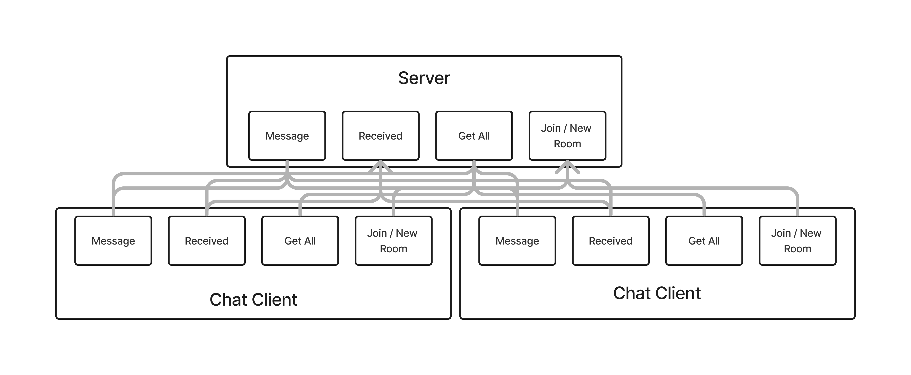

# LAB - Class 14

## Project: Terminal Chat Client

### Authors: Branden Ge and Daniel Frey

### Problem Domain

This lab demonstrates to use Socket.io to establish socket connections for an event-based, real-time chat application.

- [GitHub Client Repo](https://github.com/brandenge/terminal-chat-client)
- [GitHub Server Repo]
- [GitHub Server Deployed Site]

### Setup

`.env` Environments variables set as shown in the `.env.sample`

- `PORT`

#### Running the app

- `npm start` or `nodemon` (if you have nodemon) to start the application.

#### Features / Routes

#### UML Diagram

Diagram created with [Figma](https://www.figma.com/)

#### Credits: [Demo code from Ryan Gallaway at Code Fellows](https://github.com/codefellows/seattle-code-javascript-401d48/tree/main/class-13/inclass-demo)
